  
  
  # 👋 Adrián Roldós (@aroldos91)
  
  ### Senior Software Engineer @ XRAY Commerce | Full-Stack Architect
  
   
  
  
   

  ### [ 🇪🇸 Español ](#-español) &nbsp;&nbsp;•&nbsp;&nbsp; [ 🇧🇷 Português ](#-português) &nbsp;&nbsp;•&nbsp;&nbsp; [ 🇺🇸 English ](#-english)

---

## 🇪🇸 Español

**Sobre Mí:** Soy Ingeniero en Ciencias Informáticas enfocado en crear soluciones funcionales, escalables y orientadas al negocio. Lidero desarrollos End-to-End, desde la arquitectura y despliegue del Backend hasta interfaces Frontend de alto rendimiento. Soy una persona pragmática, orientada a resultados y apasionada por resolver problemas reales.

**💼 Experiencia Destacada:**
* 🇺🇸 **Senior Software Engineer** @ **XRAY Commerce** *(Jul 2025 - Presente)*   _Liderazgo Full-Stack, arquitectura de APIs, optimización de performance y mentoría técnica._
* 🇨🇺 **Socio / Partner** @ **Kribesoft** *(Mar 2022 - Presente)*
* 🌐 **Desarrollador Frontend & Mobile** @ **DonExpress & PartsBase Inc.** *(2022 - 2023)*
* 🚀 **Full Stack Developer** @ Múltiples entornos productivos *(Quota, Nuvimedix, Social Media Spain, EMGEF)* 

---

## 🇧🇷 Português

**Sobre Mim:** Sou Engenheiro de Informática focado na criação de soluções funcionais, escaláveis e orientadas ao negócio. Lidero o desenvolvimento de ponta a ponta, desde a arquitetura e deploy de Backend até interfaces Frontend de alta performance. Tenho um perfil prático, orientado a resultados e à resolução de problemas reais.

**💼 Experiência em Destaque:**
* 🇺🇸 **Senior Software Engineer** @ **XRAY Commerce** *(Jul 2025 - Presente)*   _Liderança Full-Stack, design de APIs, otimização de desempenho e mentoria técnica._
* 🇨🇺 **Sócio / Partner** @ **Kribesoft** *(Mar 2022 - Presente)*
* 🌐 **Desenvolvedor Frontend & Mobile** @ **DonExpress & PartsBase Inc.** *(2022 - 2023)*
* 🚀 **Full Stack Developer** @ Múltiplos ambientes produtivos *(Quota, Nuvimedix, Social Media Spain, EMGEF)*

---

## 🇺🇸 English

**About Me:** Computer Engineer focused on building functional, scalable, and business-oriented solutions. I lead end-to-end development, from Backend architecture and deployment to high-performance Frontend interfaces. I am pragmatic, results-driven, and passionate about solving real-world problems.

**💼 Highlighted Experience:**
* 🇺🇸 **Senior Software Engineer** @ **XRAY Commerce** *(Jul 2025 - Present)*   _Full-Stack leadership, API architecture, performance optimization, and technical mentoring._
* 🇨🇺 **Partner** @ **Kribesoft** *(Mar 2022 - Present)*
* 🌐 **Frontend & Mobile Developer** @ **DonExpress & PartsBase Inc.** *(2022 - 2023)*
* 🚀 **Full Stack Developer** @ Multiple production environments *(Quota, Nuvimedix, Social Media Spain, EMGEF)*

---

## 🛠️ Tecnologías Universales / Tech Stack

  

---

## 🌟 Open-Source Highlight

### 🧠 [Antigravity Mem](https://github.com/aroldos91/antigravity-mem)
Sistema 100% local (TypeScript + WebAssembly) que se integra mediante el **Model Context Protocol (MCP)**. Captura conversaciones semánticas en tiempo real permitiendo a los LLMs retener contexto de programación en memoria a largo plazo a través de múltiples sesiones de IDE.

---

## 📊 GitHub Analytics

  
  

  

---

## 📊 GitHub Analytics (Real-time & Private)

  

 

  <i>Console.log("Hello, World!");</i>

